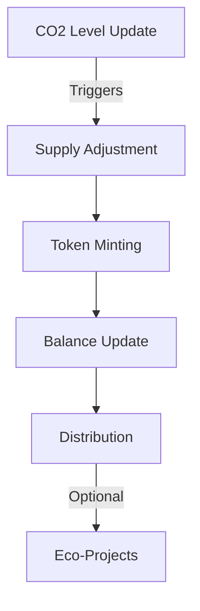

# Dynamic CO2 Token (CO2T)


A Clarity smart contract implementation of a dynamic token system that adjusts its supply based on real-world CO2 emission levels. This project aims to create a financial instrument that directly correlates with environmental impact.

## Features

- **Dynamic Supply**: Token supply adjusts based on CO2 emission levels
- **SIP-010 Compatible**: Implements the standard Stacks fungible token interface
- **Eco-Project Distribution**: Built-in mechanism for distributing tokens to environmental projects
- **Owner Controls**: Secure management of CO2 level updates and token distribution
- **Emission Factor**: Configurable multiplier for token minting calculations

## Technical Overview

### Token Specifications
- **Name**: CO2Token
- **Symbol**: CO2T
- **Decimals**: 6
- **Base CO2 Level**: 410 ppm
- **Emission Factor**: 100,000

### Smart Contract Architecture



## Getting Started

### Prerequisites

- [Clarinet](https://github.com/hirosystems/clarinet) installed
- [Stacks CLI](https://docs.stacks.co/docs/cli/overview) (optional for deployment)

### Installation

1. Clone the repository:
```bash
git clone https://github.com/yourusername/dynamic-co2-token.git
cd dynamic-co2-token
```

2. Install dependencies:
```bash
clarinet requirements
```

3. Run tests:
```bash
clarinet test
```

### Contract Deployment

1. Ensure you have the Stacks CLI configured with your deployer address

2. Deploy the contracts:
```bash
clarinet deploy --network mainnet/testnet
```

## Usage

### Reading CO2 Token Data

```clarity
;; Get current token supply
(contract-call? .dynamic-co2-token get-total-supply)

;; Check account balance
(contract-call? .dynamic-co2-token get-balance tx-sender)
```

### Managing CO2 Levels

```clarity
;; Update CO2 level (contract owner only)
(contract-call? .dynamic-co2-token set-co2-level u420)
```

### Token Operations

```clarity
;; Transfer tokens
(contract-call? .dynamic-co2-token transfer u1000 tx-sender recipient none)

;; Distribute to eco-project
(contract-call? .dynamic-co2-token distribute-to-project project-address u5000)
```

## Project Structure

```
dynamic-co2-token/
├── contracts/
│   ├── sip-010-trait.clar
│   └── dynamic-co2-token.clar
├── tests/
│   └── dynamic-co2-token_test.ts
├── Clarinet.toml
└── README.md
```

## Testing

Run the test suite:
```bash
clarinet test
```

Key test scenarios:
- Token operations (transfer, minting)
- CO2 level management
- Authorization checks
- Distribution mechanics

## Contributing

1. Fork the repository
2. Create a feature branch
3. Commit your changes
4. Push to the branch
5. Open a Pull Request

Please ensure your PR includes:
- Clear description of changes
- Updated tests
- Documentation updates if needed

## Security

- Only contract owner can modify CO2 levels
- Transfer functions include authorization checks
- Balance checks prevent overflow/underflow
- Token minting is controlled and verifiable

## License

This project is licensed under the MIT License - see the [LICENSE](LICENSE) file for details.

## Contact

- **Author**: Bolt
- **GitHub**: [github.com/jessycodegold](https://github.com/jessycodegold)
- **Email**: jessicaagukwe2@gmail.com

## Acknowledgments

- Stacks Foundation for SIP-010 standard
- Environmental data providers
- Clarity community

---
*Note: This project is in beta. Use in production at your own risk.*
